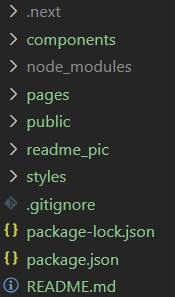
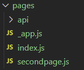
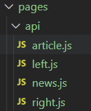

# 字节跳动前端课程大作业
## 项目运行
```bash
cd finalproject-weibo
npm install
npm run dev
```
项目运行在http://localhost:3000/
## 项目介绍

1. 复刻已有产品——微博网页版

    https://weibo.com/?category=1760

    https://weibo.com/ttarticle/p/show?id=2309354634302900994573

  

2. 数据均存在本地，可以在断网的情况下可以正常运行、演示

3. 实现内容：
    - 首页 ✅Cancel changes

    - 二级页面 ✅

    - 首页可以导航到二级页面 ✅

    - 支持**SSR** ✅

      

## 实现细节

1. 使用**Next.js**框架进行组件化开发，工程目录如下

    

    主页在**index.js**中实现，二级页面在**secondpage.js**中实现

    

    两个页面均使用**components**中的组件，其中**Header**由两个组件公用

2. 页面间跳转采用**Next.js**路由
```jsx
 <Link href="/secondpage"><a>{ title }</a></Link>
```
3. 所有的新闻数据均由后台**api**发送，**Next.js**自带**SSR**功能，使用`getServerSideProps`函数从api中进行数据拉取和渲染
```jsx
export const getServerSideProps = async () => {
  let res = await fetch(`http://localhost:3000/api/left`)
  let data = await res.json()

  let resp = await fetch(`http://localhost:3000/api/news`)
  let list = await resp.json()

  let reshottopic = await fetch(`http://localhost:3000/api/right`)
  let hottopic = await reshottopic.json()

  return { 
      props: { channels: data.data, list: list.data , hottopics: hottopic.data}
  }
}
```
**left.js**发送首页左侧选项栏，**news.js** 发送首页和二级页面的新闻列表，**right.js**发送首页右侧热搜栏，**article.js**发送新闻内容




   
